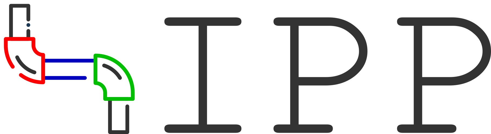

# Image Processing Pipeline (IPP)

## Brief
**Image Processing Pipeline (IPP)** is a Python image processing helper.

This program processes images through a **pipeline architecture**, where the filters are arranged as pipes and connected by buses.

This program can be integrated into another Python application as a library.

## Wiki
https://github.com/FilipeChagasDev/image-processing-pipeline/wiki

## Dependencies
* Python v3
* NumPy
* OpenCV (cv2)

## Team
* **Filipe Chagas** (project owner) *github.com/filipechagasdev*
  
## Progress

### Main architecture
* [x] Bus class *(done at v0.1.0; tested)*
* [x] Pipe class *(done at v0.1.0; tested)*
* [x] Pipeline class *(done at 0.1.0; tested)*
* [x] Plug-in loading *(done at 0.4.0; tested)*
* [ ] XML parsing
* [ ] Helper

### Pipes
* [x] Split and merge pipes *(done at 0.2.0; tested)*
* [x] Fork and blend pipes *(done at 0.3.0; tested)*    
* [x] Addition pipe *(done at 0.5.0; tested)*
* [x] Product pipe *(done at 0.6.0; tested)*
* [x] Hadamard pipe *(done at 0.7.0; tested)*
* [ ] Amplify pipe
* [ ] Binarize pipe
* [ ] BGR to HSV converter pipe
* [ ] HSV to BGR converter pipe
* [ ] RGB to BGR converter pipe
* [ ] BGR to RGB converter pipe
* [ ] Colorize pipe
* [ ] Equalize histogram pipe
* [ ] Ajust average pipe
* [ ] Ajust deviation pipe
* [ ] Median blur pipe
* [ ] Convolution pipe
* [ ] Functional generator pipe
* [ ] Functional processor pipe
* [ ] Space domain to frequency domain pipe
* [ ] Frequency domain to space domain pipe

### Documentation
* [x] Abstract
* [ ] Introduction
* [ ] Architecture overview
* [ ] Pipe architecture explanation
* [ ] Bus architecture explanation
* [ ] Pipeline architecture explanation
* [ ] Split and merge pipes explanation    
* [ ] Addition pipe explanation
* [ ] Product pipe explanation
* [ ] BGR to HSV converter pipe explanation
* [ ] HSV to BGR converter pipe explanation
* [ ] RGB to BGR converter pipe explanation
* [ ] BGR to RGB converter pipe explanation
* [ ] Equalize histogram pipe explanation
* [ ] Ajust average pipe explanation
* [ ] Ajust deviation pipe explanation
* [ ] Gaussian blur pipe explanation
* [ ] Median blur pipe explanation
* [ ] Tutorial 0 - Basic bypass pipeline 
* [ ] Tutorial 1 - Images mixing (blend)
* [ ] Tutorial 2 - Grayscale effect (split & blend)
* [ ] Tutorial 3 - Sepia effect (split & blend & colorize)
* [ ] Tutorial 4 - Soft blue effect (split & amplify & addition)
* [ ] Tutorial 5 - Brightness ajust (bgr->hsv & split & addition & merge & hsv->bgr)
* [ ] Tutorial 6 - Saturation ajust (bgr->hsv & split & addition & merge & hsv->bgr)
* [ ] Tutorial 7.1 - Contrast ajust 1 (bgr->hsv & split & amplify & merge & hsv->bgr)
* [ ] Tutorial 7.2 - Contrast ajust 2 (bgr->hsv & split & product & merge & hsv->bgr)
* [ ] Tutorial 7.3 - Contrast ajust 3 (bgr->hsv & split & ajust deviation & merge & hsv->bgr)
* [ ] Tutorial 7.4 - Contrast ajust 4 (bgr->hsv & split & equalize hist & merge & hsv->bgr)
* [ ] Tutorial 7.5 - Contrast ajust 5 (bgr->hsv & split & fork & equalize hist & blend & merge & hsv->bgr)
* [ ] Tutorial 7.6 - Contrast ajust 6 (bgr->hsv & split & fork & functional processor & blend & merge & hsv->bgr)
* [ ] Tutorial 8.1 - Smoothing 1 (median blur)
* [ ] Tutorial 8.2 - Smoothing 2 (convolution with gaussian kernel)
* [ ] Tutorial 9 - Edge segmentation (bgr->hsv & convolution with laplacian or derivative kernel & binarize & fork & merge)
* [ ] Tutorial 10 - sharpness ajust (split & space to freq & functional gen & fork & hadamard & freq to space & merge)